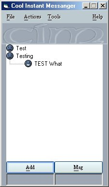



## COOL Instant Messanger     Check This out

### Description

Every line is commented teaches you how to understand winsock use list controls, databases, string manipulation, multiple connections via internet, send and receive files via internet and much much more to come

So check back for the latest updates

Feel free to vote / Leave a comment

let me know what you think about this submission to PSC

Just uploaded newest code /fixed few bugs/ did some major changes to the client side and minor changes to the Server.

Also i created my own menus' status bar etc..

Shows how to easily use the TreeView cntrl

and much more.

So leave your comments if you would like the code to keep on!
 
### More Info
 

             |
---                |---
**Submitted On**   |2002-02-24 20:40:48
**By**             |[W\. LeRoy](https://github.com/Planet-Source-Code/PSCIndex/blob/master/ByAuthor/w-leroy.md)
**Level**          |Beginner
**User Rating**    |4.5 (18 globes from 4 users)
**Compatibility**  |VB 5\.0, VB 6\.0
**Category**       |[Internet/ HTML](https://github.com/Planet-Source-Code/PSCIndex/blob/master/ByCategory/internet-html__1-34.md)
**World**          |[Visual Basic](https://github.com/Planet-Source-Code/PSCIndex/blob/master/ByWorld/visual-basic.md)
**Archive File**   |[COOL\_Insta573522242002\.zip](https://github.com/Planet-Source-Code/w-leroy-cool-instant-messanger-check-this-out__1-32085/archive/master.zip)

